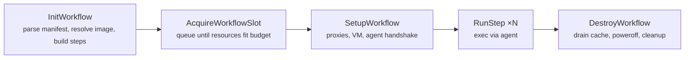
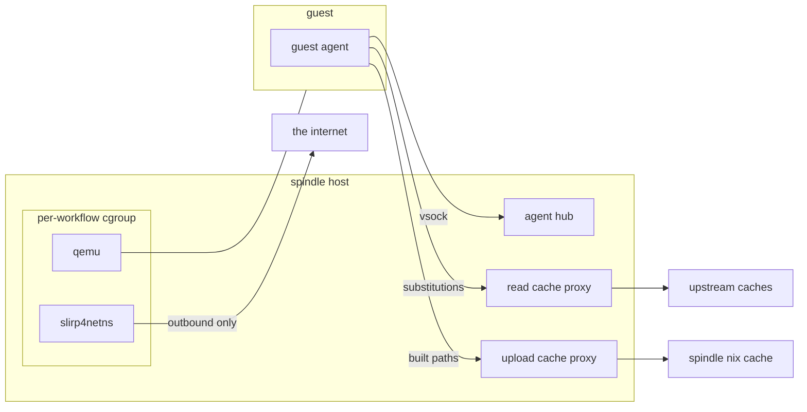

# spindle microVM engine

This document describes the architecture of the microvm engine for spindle. In
short it allows the spindle to spin up microvm guests, and implements a guest
[agent protocol](../../agentproto) for communicating with those guests (via the
[shuttle](../../../shuttle) implementation of that proto). It implements some
fairly simple resource budgeting and optionally sets up cgroups for better
enforcing resource limits, and hardens the VM network access. It has Nix cache
integration for any paths built in the VM, those will get pushed to a Nix cache
by the spindle (if one is configured). The runner is abstracted behind an
interface; right now only the QEMU microVM impl is supported, but others (e.g.
firecracker) can slot in later.

Currently two kinds of images are supported:

- NixOS images: these allow configuration such as `dependencies`, `services`,
  `virtualisation`, `registry`, `caches` in the workflow file itself. The guest
  agent will build (or if it's cached, spindle will send the store path for
  realization) and activate it before any workflow steps are ran.
- Non-NixOS: this is mainly just Alpine for now, but can be anything else.
  Workflow-level configuration like NixOS aren't supported while using these. If
  Nix exists inside the image (like in our Alpine image) it will still be able
  to make use of the spindle cache.

(For testing, you can run `bash spindle/engines/microvm/test-spindle-microvm.sh`
from repo root. These test the Alpine & NixOS, and features like if Docker
works, public internet is reachable, and so on.)

## Image builds

Image builds right now are done via Nix:

- For NixOS, we use [microvm.nix](https://github.com/microvm-nix/microvm.nix),
  and layer our own configs on-top, see [here](../../../nix/microvm).
- For Alpine we have a small-ish Nix definition that includes fetching the
  kernel, initrd, kernel modules; setting up the init script that configures the
  VM proper; copying dependencies (like `nix` or `git`) into a rootfs and
  creating a squashfs from it.

This does not mean it *has* to be done via Nix, as long as your images are what
spindle expects, they should work. That is:
- a guest agent is present inside of the image and when that image boots it will
  get started,
- `spindle-workflow` user exists,
- and the work directory is configured (`/workspace`).

## Image discovery

Each built image ships with a `spec.json` next to its artifacts. This spec
describes everything needed to run the image: the kernel, initrd and read-only
store disk paths, boot args, memory/vCPU sizing, the shell used for workflow
steps, writable volumes, network interfaces, and runner-specific config (machine
type, CPU, extra args for QEMU). NixOS images also carry a `baseConfigHash`
identifying the base configuration baked into the image.

An image lives in the configured image directory either as a directory
containing a `spec.json` (alongside the kernel/initrd/store-disk artifacts) or,
for a self-contained spec, as a flat `<name>.json` file. An operator keeping
multiple arches side by side can name them `<name>-<arch>` (eg. `nixos-x86_64`,
`alpine-aarch64`); that arch suffix is just part of the name, not something
resolution infers.

A workflow names an image with the `image` key at top-level (falling back to
`SPINDLE_MICROVM_PIPELINES_DEFAULT_IMAGE` if unset). The name is matched
literally: we look for `<name>` (a directory with a `spec.json`) then
`<name>.json`. Resolution depends only on the name and what is on disk, never on
the host, so the same workflow resolves identically on every spindle. If for
example an operator wants `nixos` to work, they can symlink `nixos` to
`nixos-x86_64`.

The spec is validated at resolve time (required fields, positive sizes etc.),
and right before launch we also check the referenced files actually exist on
disk and that the host has the commands we need: `mkfs.ext4` for volume
formatting, plus whatever the selected runner requires. For QEMU that's the QEMU
binary for the spec's arch, `/dev/vhost-vsock` (for guest vsock configuration),
`/dev/vsock` (for host listener sockets), `/dev/kvm` (if KVM is enabled), `/dev/net/tun`
(for guest networking), and the `ip`, `mount`, `slirp4netns`, `unshare` toolchain when the
image has network interfaces.

## microVM lifecycle



While a workflow is running, things look like this (everything inside the cgroup
box is what gets resource-limited):



`InitWorkflow` parses the workflow manifest, resolves the image, and assembles
the step list: the clone step first, then (for NixOS images with a workflow
config) a "NixOS config activation" system step, then the user steps. Before any
of this actually runs the workflow has to acquire a slot from the resource
scheduler, each image declares its memory/vCPUs/disk and workflows queue until
their request fits within the configured budget. The scheduler is
work-conserving with aging and per-user fairness, so one user submitting a pile
of jobs won't starve everyone else, and slots don't sit idle while there's
queued work that fits in the budget.

### Configuration

Setup allocates a random vsock CID for the guest and registers it with the agent
hub, which listens on a single host vsock port. Incoming agent connections are
matched to workflows by CID, anything with an unknown CID is dropped. It then
creates a per-workflow work directory and starts three host-side proxies the guest
reaches over vsock: a read cache proxy (fronting the configured Nix substituters
plus any workflow-level `caches`) and an upload cache proxy (for pushing paths
built in the guest to the spindle's cache), plus a DNS proxy that resolves
through the host's resolver and filters private/special-purpose address answers.

Then the VM itself. Writable volumes from the spec are created as sparse files
and formatted ext4, the store disk is attached read-only. QEMU runs with
`-sandbox on`, `-nodefaults`, no display/monitor, etc., serial output to a log
file, and a QMP socket for control.

For network hardening: if the image has network interfaces, QEMU doesn't run in
the host network namespace at all. We `unshare` into fresh user/net/mount
namespaces, and a small wrapper script inside the namespace bind-mounts a
resolv.conf that disables qemu's slirp DNS and adds blackhole routes for every
special-use IPv4/IPv6 range (RFC 6890, so private networks, link-local,
loopback, CGNAT, multicast, ULAs and so on) before exec'ing QEMU. `slirp4netns`
(with `--disable-host-loopback`, sandbox and seccomp enabled) then provides
outbound connectivity for the namespace. The guest's `/etc/resolv.conf` points
at shuttle on localhost; shuttle forwards DNS packets over vsock to the
host-side DNS proxy. The guest sits behind a second layer of QEMU user-mode
networking inside that namespace, so guest traffic can only ever reach the
outside world, never the host or anything on its local networks.

Optionally the whole thing (QEMU and slirp4netns) is placed in a per-workflow
cgroup with memory, swap and pids limits, so the budget above is actually
enforced and not just bookkeeping. That also allows us to, for example, if the
cgroup OOM-kills the VM we can detect that and report it as such instead of a
generic crash. The spindle supervisor itself also gets a cgroup with a
protected `memory.min`, so under host memory pressure it's the workflows that
get OOM-killed first, not spindle.

### Boot - run - death

Once QEMU is up we poll the QMP socket until it accepts a connection and reports
the guest as running, then wait for the guest agent to send handshake message
over vsock from the expected CID. It reports its protocol and versions, and
spindle sends it the job id, trusted cache public keys, and the cache/DNS proxy
ports.

First the activation step is ran (if on a NixOS image and the workflow is
configured with anything), spindle sends the user config (or a cached toplevel
store path, if we've built this exact base + config combo before) and the agent
builds and activates it before the user steps run. Afterwards, each step is sent
as an exec request (`$shell -lc <command>` as an unprivileged workflow user in
`/workspace/repo`, with workflow/step environment and unlocked secrets), and
stdout/stderr stream back as messages until an exit message arrives. Timeouts
are cooperative: we derive a deadline from the workflow timeout and ship it to
the guest, with a little grace on the host side so the guest gets to report the
timeout itself. While a step runs we also watch for the VM crashing, if it does
we tail the serial (and qemu) logs into the step's stderr so you get something
more useful than "guest agent connection lost: EOF".

Teardown is same whether the workflow succeeded, failed or timed out: drain the
guest's pending Nix cache uploads, ask the agent to power off and wait for QEMU
to exit (falling back to QMP `system_powerdown` and finally a kill if it
doesn't), then close the proxies and remove the work directory. For non-HTTP
upload targets the host-side import already happened synchronously when the
guest committed each narinfo, so there is no second host-side cache drain step
at teardown.

### Nix cache

The two host-side proxies are how the guest talks to spindle's Nix cache without
ever needing credentials or direct network access; like the agent they reach the
host over vsock.

The read proxy fronts the configured substituters plus any workflow-level
`caches`. When the guest needs to realize a store path it asks the proxy, which
queries the read caches concurrently and returns the first successful response,
with a 404 only winning if every upstream returns 404.

The upload proxy goes the other way: paths built inside the guest are pushed to
spindle's configured upload cache (if any) so the next workflow that needs them
doesn't rebuild. Paths already present on any configured read cache are skipped.

For `http://` and `https://` upload targets the proxy just reverse-proxies the
guest's binary-cache upload traffic to the configured remote cache, while still
answering narinfo existence checks across the upload target plus the read
caches.

For `ssh://`, `ssh-ng://`, `daemon`, and `local` targets spindle implements the
small HTTP binary-cache upload surface itself. It stages uploaded `nar/` objects
and narinfos under the workflow workdir, validates the narinfo, then treats the
narinfo upload as the commit point: once `<hash>.narinfo` is written spindle
runs:

```bash
nix copy \
  --from file://<staging-dir> \
  --to <target-store> \
  --no-check-sigs \
  --substitute-on-destination \
  <store-path>
```

That copy is synchronous. If it fails, spindle removes the staged narinfo again
so future `GET`/`HEAD <hash>.narinfo` requests do not falsely dedupe a path that
never made it to the destination store. The guest still only ever sees the same
HTTP binary-cache upload protocol over vsock; it never gets direct access to
SSH credentials or the destination store itself.
