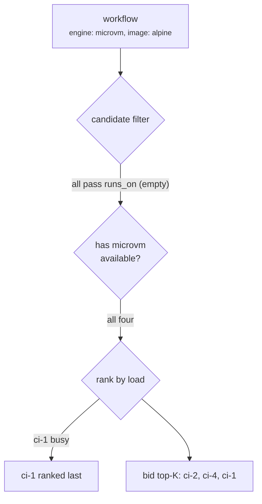
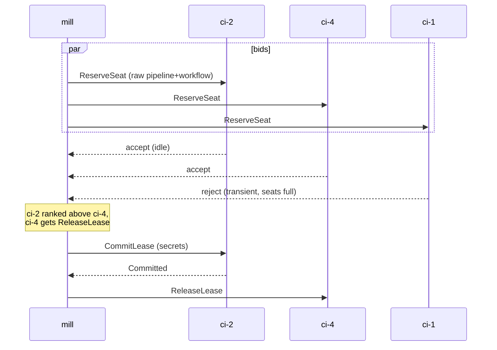
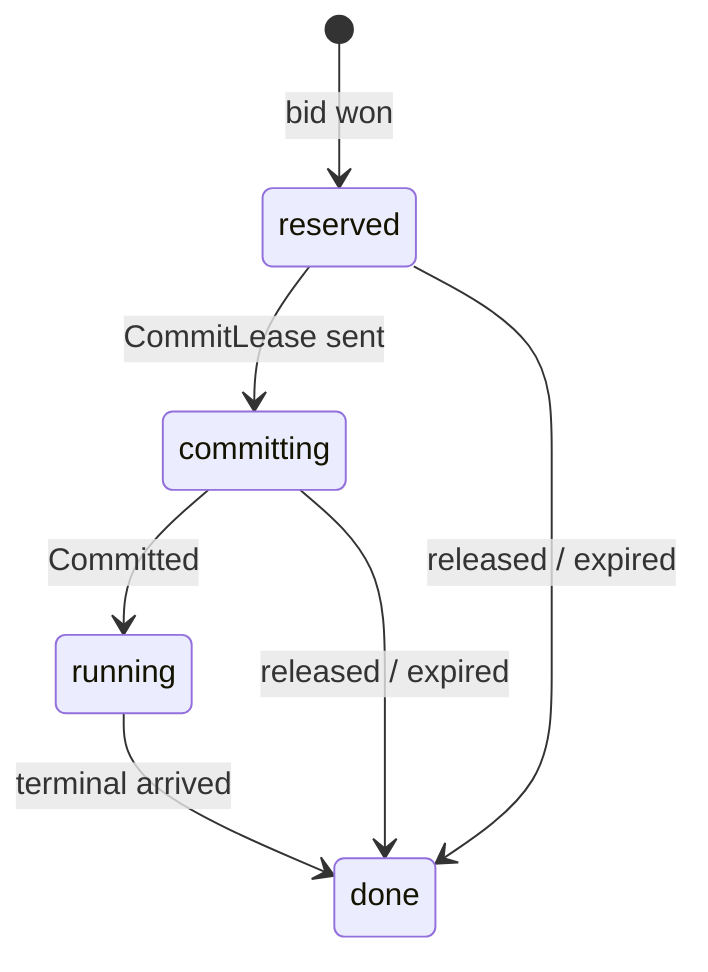

# spindle mill

This document describes the architecture of the mill, spindle's distributed
job placement layer. A mill is a spindle that doesn't run jobs itself: it
places them on remote executors, which run the real engines (microvm, nixery,
dummy) exactly as they would standalone.

## The engine mirroring model

Neither side's execution path changes between local and remote runs.

On the mill host, engines are registered under the real engine names
("microvm", "nixery", "dummy"), but each is a stand-in that places jobs
remotely instead of running them. `InitWorkflow` on the stand-in parses
nothing, it stashes the raw pipeline and workflow and builds a synthetic
one-step workflow, so everything upstream (trigger handling, pending status,
`TANGLED_*` env) behaves exactly like a local run. The real `InitWorkflow`
runs exactly once, on the executor.

On the executor, the reserve handler wraps the real engine in a
`reservedEngine`: the slot acquired when the reservation is accepted is the
same slot `StartWorkflows` later runs on. Nothing acquires twice, and from the
engine's point of view the job is indistinguishable from a local one.

The same mirroring applies to output: the executor's jobs write status rows
and log lines exactly like a standalone spindle, and the mill re-authors them
into its own event stream and log store, so appview and the log endpoints see
no difference between a local and a remote job.

The only real divergence: secrets are withheld from untrusted pipelines at the
mill, and they cross the wire exactly once, inside `CommitLease`, to the one
node that won the bid. Losing bidders never see them.

## Placement: labels, seats, and rejection

Placement decides which executors can run a workflow right now, using one
kind of fact:

- **labels** are operator-defined strings on the executor's token, checked
  against the workflow's `runs_on`. they're for coarse fleet partitioning
  ("this pool is for trusted jobs", "this box has a gpu"), nothing more

Matching is exact intersection: candidate sessions whose snapshot has the
engine available, a free seat, and labels covering `runs_on`. Among the
eligible candidates the mill ranks least-loaded first and bids the top-K
concurrently with `ReserveSeat`. The best-ranked accept wins, losers get
`ReleaseLease` so they free their held seats immediately. If nobody
accepts, the job waits for a change: a new executor connecting, a snapshot
flipping availability, or a lease finishing somewhere.

Image and arch compatibility is deliberately *not* a mill concern. The mill
never parses an image name or an arch string; the executor re-validates
everything at reserve time against its own disk (engine exists, workflow
parses, the image spec validates and is natively runnable, the runner is
usable) and rejects what it can't run with `incompatible`. A reject rotates
the bid to the next candidate, and if every candidate rejects, the user
gets the collected reasons as the placement error. Multi-arch falls out of
this: an arm64 box simply cannot accept an x86_64 image, so it never holds
one. If you *want* to pin an arch or an image explicitly, label the nodes
and use `runs_on`.

### Example: an alpine microvm job

Say a workflow asks for the microvm engine with `image: alpine`, no
`runs_on`, and the fleet looks like this:

| node    | arch    | labels  | engines           | load   |
|---------|---------|---------|-------------------|--------|
| ci-1    | x86_64  | [linux] | microvm           | busy   |
| ci-2    | aarch64 | [linux] | microvm           | idle   |
| ci-3    | x86_64  | [linux] | microvm, nixery   | idle   |
| ci-4    | x86_64  | [gpu]   | microvm           | idle   |

The walkthrough:

Say ci-2's alpine image is actually x86_64-only: the mill offers the bid
anyway, ci-2's reserve-time validation rejects it as incompatible, and the
bid rotates to ci-4. The mill learns "ci-2 can't run alpine" from the
rejection, not from any advertisement, and the reason reaches the user if
every candidate fails the same way.

The bid then runs concurrently:

Both idle nodes accepted, so rank breaks the tie: ci-2 keeps the seat, ci-4
frees its immediately, and only ci-2 ever sees the secrets. From here ci-2
runs the job exactly like a standalone spindle would, booting the alpine
image under QEMU, while the mill blocks on the terminal event.

## The protocol's durability model

Executor to mill is a single websocket per node, and everything the executor
reports (status, logs, terminal results) travels as sequenced `Event`s. Two
identifiers keep it all consistent:

- the **epoch** names one lifetime of the executor process. a restarted
  executor connects with a fresh epoch, and anything arriving for an old one
  is invalid. leases are bound to node+epoch, so a zombie from a previous
  process can't act on them
- the **seqno** is a dense per-epoch counter on events. the executor persists
  events in a local outbox before sending and trims it only when the mill
  acks. on reconnect it resumes from the mill's acked position and replays.
  the mill applies idempotently: replays drop, gaps kill the session

The mill is equally restartable: leases, acked positions and the canonical
log all live in its db. Restored leases start as orphans and must be
reclaimed by the executor's first snapshot, or a sweep fails them after one
grace window. The invariant throughout: at any moment, for any lease, exactly
one of {executor outbox, mill db} holds the newest state, and the seqno/epoch
pair says who.

## Leases

A lease is the mill-side handle for one placed job:

Commit retries ride reconnects: a reservation outlives one disconnect, so a
lost session means wait and retry, not a failed job. What ends a job is the
job timeout, a terminal event, or the executor being declared dead after
reconnect grace expires, at which point every lease the node held fails
(preserving a pending cancellation as the reason).
